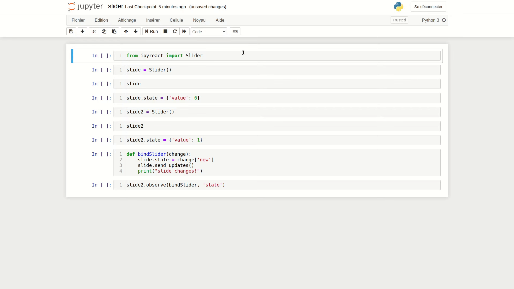

# ipyreact
[](https://ipyreact.readthedocs.io/en/latest/?badge=latest)
[](https://mybinder.org/v2/gh/weatherforce/ipyreact/master?filepath=examples)

This project aim to provide an alternative solution to build widget and use them on a jupyter notebook.
It uses React for the front end, which provides a simple way to build complex widgets.In addition, It 
will open the way to the integration of React libraries in Jupyter notebooks, such as material-ui, among
others.



## Installation
This guide assumes that you are using a linux based system.

## System requirements
- npm
- python3 (it has been tested using python 3.7)
- pip

## Building JavaScript
This builds the react javascript.

```bash
npm install -C nbextensions_srcs && npm run dev -C nbextensions_srcs
```
You should now have a nbextensions_dists folder

### Installing Python packages
For installing the python packages an we recommend using a virtual environment
```bash
python3 -m venv ipyreactvenv
source ipyreactvenv/bin/activate
pip install -r dev_requirements.txt
pip install .
```

## Running Jupyter notebook
In the same terminal as your virtual environment run:

```bash
jupyter notebook examples/slider.ipynb
```

There are other example ipynb which can be found in the examples folder
