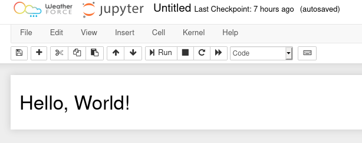

# React Extension trial

## Intro

The goal here is to explore webpack ability to pass from JSX with ES6 way of handling import/export into an AMD "compliant" bundle. The idea behind is to find a way to make widgets using React on front end as an alternative of ipywidgets library and its uses of Backbone framework. 

## setting up

### general set up

To begin with, I suggest that you create a dedicated space for your trial to live in. The reason why is that by the end of this cookbook, we will have created a bunch of configuration files, code sources, and production code. In addition, we will use Node Package Manager, to import React, babel and webpack. Make sure you have NPM or even better, yarn installed.

> Note: make sure your package manager is up to date

So let's create a basic set up for a node package

```bash
mkdir react_extension
cd react_extension
yarn init
mkdir src dist
touch src/index.js 
```

### Installing Webpack 

Webpack is a bundler, it fetches source code, and creates an output that is simpler to manipulate. That's its whole purpose, but by binding webpack with some other services such as babel, you can minify it, or even transpile it into different version of JavaScript, and this is mandatory to be browser compliant. So let's install webpack as a development dependency:

```bash
yarn add webpack webpack-cli --dev
```
To work with webpack, it needs a configuration files, called webpack.config.js. It's a quiet simple, following the documentation, we will provide a first iteration: 
 
```bash

touch webpack.config.js

```
and editing webpack.config.js

```javascript

const path = require('path');

module.exports = {
  entry: './src/index.js',
  output: {
    filename: 'main.js',
    path: path.resolve(__dirname, 'dist'),
  },
};
```
What we are doing in this configuration, is simply read from entry point index.js in src folder, and create an output in dist folder. So for now, it is not very useful... It will soon be though! 
Now we need to automate the bundling, by making scripts into our package.json.

Let's add a watch, dev and build script to our project:

within your project package.json:

```javascript
"scripts": {
  "build": "webpack -p",
  "watch": "webpack --watch",
  "dev": "webpack --mode development"
}
```

Now if you run:

```bash

yarn build && ls dist/

```

should give this output:

```bash

...
[webpack output]
...
main.js

```
I don't really want to cover all webpack options here, but just remember that
-p stands for production, which is minimized to be as light as possible. but it
isn't the best way to debug your code. To do so we have the development
bundling command which is dev script, that can be sometime useful. Yet the best
one would definitely be the watch script, that will automatically rebundle your
code every time it detects a change on one of the sources files involved. 

## Adding React to the equation

Having nicely set up our project, we can now enter the heart of the matter. In this section we will install React, make a very simple React Component to render, and render it into our notebook.

### Install React

```bash
yarn add react react-dom
```
Once installed, we can start to write some code and try to build it.

### Writing Code 

We need to modify our `index.js` file to look like the code below:
```javascript

import React from 'react'
import ReactDOM from 'react-dom'
import App from './App'

ReactDOM.render(<App/>, document.getElementById('notebook-container'))

```
What we are doing here is rendering an App component into the notebook
container element, which has the id `notebook-container`.

Anyway, we don't have an App yet, so we need to create it. In the same src folder create `App.js` and add the following to it:

```javascript
import React from 'react'

const App = () => {
    return <h1>Hello, World!</h1>
}
export default App

```
And its about time to build! At this point `yarn build` will unfortunately crash miserably...  Next step: be able to build!

### Bundling

According to Webpack error messages, we need a transpiler to understand JSX, which is React's javascript flavour. So we need to call Babel to the rescue.
Below are the commands to install babel:

```bash
yarn add @babel/core babel-loader @babel/preset-env @babel/preset-react --dev
touch .babelrc
```

Then, editing your `.babelrc`

```javascript
{
  "presets": ["@babel/preset-env", "@babel/preset-react"]
}
```

Let's update `webpack.config.js`, it should then looks like this:


```javascript
const path = require('path');

module.exports = {
  entry: './src/index.js',
  output: {
    filename: 'main.js',
    path: path.resolve(__dirname, 'dist'),
  },
  module: {
    rules: [
      {
        test: /\.(js|jsx)$/,
        exclude: /node_modules/,
        use: {
          loader: "babel-loader"
        }
      }
    ]
  }
};
```
you can now hit `yarn build` again, and it will build.

>Note: For more about setting up React from scratch using webpack and Babel, see [this very fine article](https://www.valentinog.com/blog/babel/).

## Live testing 

Now we want to be able to test it very quick within a notebook. So we have to turn this into an extension.
To do so, we will use asynchronous imports from ES6 syntax. Let's change our `src/index.js` file:

```javascript
import React from 'react'
import ReactDOM from 'react-dom'
import App from './App'

let promise = import('base/js/namespace')

export const load_ipython_extension = () => {
  promise.then(Jupyter => {
    console.log("Hello from React")
    ReactDOM.render(<App/>, document.getElementById('notebook-container'))
  })
}
```

Let's build:

```bash
yarn build
```

It fails with this error:

```
ERROR in ./src/index.js
Module not found: Error: Can't resolve 'base/js/namespace' in '/home/al/essai/react_extension/src'
 @ ./src/index.js 4:14-41
[...more warning...]
```

Here the problem is that webpack can't find the `base/js/namespace` dependency.
We won't provide the dependency because it will be provided by Jupyter. We tell
webpack that it's fine using the
[externals](https://webpack.js.org/configuration/externals/) option. We also make it compile the code as an AMD module, which the format supported by Jupyter Notebook.

```javascript
const path = require('path');

module.exports = {
  entry: './src/index.js',
  output: {
    filename: 'main.js',
    path: path.resolve(__dirname, 'dist'),
    // Compile as an AMD (RequireJS-style) module
    libraryTarget: 'amd'
  },
  module:{
    rules:[
      {
        test: /\.(js|jsx)$/,
        exclude: /node_modules/,
        use: {
          loader: "babel-loader"
        }
      }
    ]
  },
  // This will be available on the page
  externals: ['base/js/namespace']
};
```

At this point, `yarn build` should work.

Now we'd like to test what we've done within a notebook. Let's install and enable the extension:

```bash
cd ..
source venv/bin/activate
jupyter nbextension install dist/ --sys-prefix --symlink
jupyter nbextension enable dist/main --sys-prefix
jupyter notebook
```

Now if we create a notebook, we should see *Hello from React* in the JavaScript console and we should
see *Hello, World!* in the notebook:



We've just built our first Notebook extension with React.
